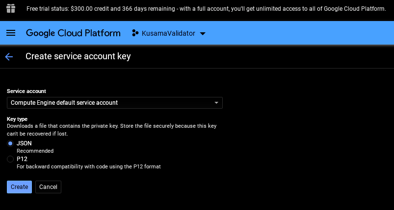

# Getting Started

The following will help get up and running with a Kusama validator node.

## Setting up a VPS

Nodes can run in the cloud, on bare metal, or on-premise. While on-premise and bare metal is preferred, the following proposes cloud providers like GCP, as they provided free credits that allow you go get up and running with little finincial commitment at first. It's recommended that nodes get spread out throughout multiple cloud providers and datacenters, the following should be a starting point to further refine your setup.

## GCP
### Create a Google Cloud Platform Account

1. Create an account on Google Cloud Platform
2. Create a project on Google Cloud Platform, for example `KusamaValidator`
   
   

3. After Compute Engine intializes (it may take a few minutes), [create a Compute Engine service account key](https://console.cloud.google.com/apis/credentials/serviceaccountkey?_ga=2.200408430.115747434.1580487834-927118280.1575805433&_gac=1.55674585.1580204272.CjwKCAiA1L_xBRA2EiwAgcLKAz_8bCEQ_Lu6p8_iKNfze_a3QBpKDqtMi9UoAWKlJXbpQOW9aBkDcxoC254QAvD_BwE), rename it to `credentials.json`, and place it in the repository root folder. 


## Install Terraform

1. [Install the Terraform binary to the local machine](https://learn.hashicorp.com/terraform/getting-started/install.html)

## Setup SSH Keys

1. Run `./scripts/gen_ssh_key.sh` from the root directory of the project, or create a new ssh pair named `id_rsa` in the `.ssh` directory of this project
2. update terraform.tfvars to have the `public_key_path` and `private_key_path` correspond to the public and private ssh keys that were just generated.


## Set up `terraform.tfvars`
Fill in the following:

// GCP Project name id, for example, the id is `kusamavalidator` if the project name is `KusamaValidator`

project_name = ""

// Name of the setup script located in the `scripts` directory, for example, `setup.sh` from `../scripts/setup.sh`
script_name = ""

// Path of the public SSH key, for example `../.ssh/id_rsa.pub` if you created the ssh keys using the `scripts/generate_ssh_keys.sh` bash script
public_key_path = ""

// Path of the private SSH key, for example, `../.ssh/id_rsa` if you created the ssh keys using the `scripts/generate_ssh_keys.sh` bash script
private_key_path = ""

// Path of the GCP service account credentials, for example, `../credentials.json` located in the root of the project directory
service_key_path = ""

// Username of the user accessing the host, for example the output of `echo $USER`
username = ""

// (Optional) URL of a tar file of a backed up DB - this is if you backup your db folder to a tar file and upload it to some url. If so, the file will be downloaded and unpacked to the `/db` folder before the node is run.
db_url = ""


## Run Terraform scripts

1. Move into the terraform directory: `cd terraform`
2. Initialize configure Terraform backend: `terraform init`
3. Validate the terraform configuration to ensure there are no errors: `terraform validate`
4. Create execution plan: `terraform plan`
5. Te and `terraform apply`. This should take ~10 minutes for the node to start syncing

## Create Session Keys

1. After the node is syncing, SSH into the box:
   
   ```
   ssh -i ../.ssh/id_rsa `terraform output ip`
   ```

and use the `author_rotateKeys` RPC call from within the Docker container:

```
sudo docker exec -i kusama-validator curl -H "Content-Type: application/json" -d '{"id":1, "jsonrpc":"2.0", "method": "author_rotateKeys", "params":[]}' http://localhost:9933
```


The output will look something like:

> {"jsonrpc":"2.0","result":"0xeadd8348a5cfec023c8c8dd50cd332431db87f945d4810192ad84e707b9032a7b2cbbf5a4aa996320107c6451b323793327503bd1b51f7e09a04148dbd043407b84a81df88eb15b1cb91213ef1457d790d81214aa9e52fd7de4ad1b877df3563f206b0144d58b313bed6719d2194b1ded90481c7ac30cb420505ea0b0185dc7c68bb08d7326b0568297bd3e5ea9c7113fffdbc3c3ead931d7259ec061adcc03e","id":1}

## Set Session Keys and Validate

1. Inject the above result and submit a `Validate` Extrinsic


